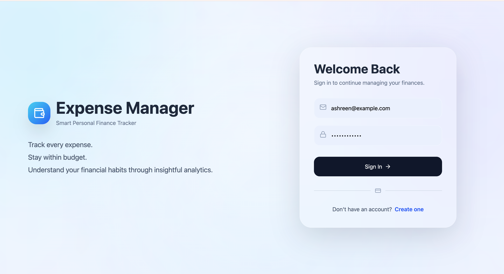
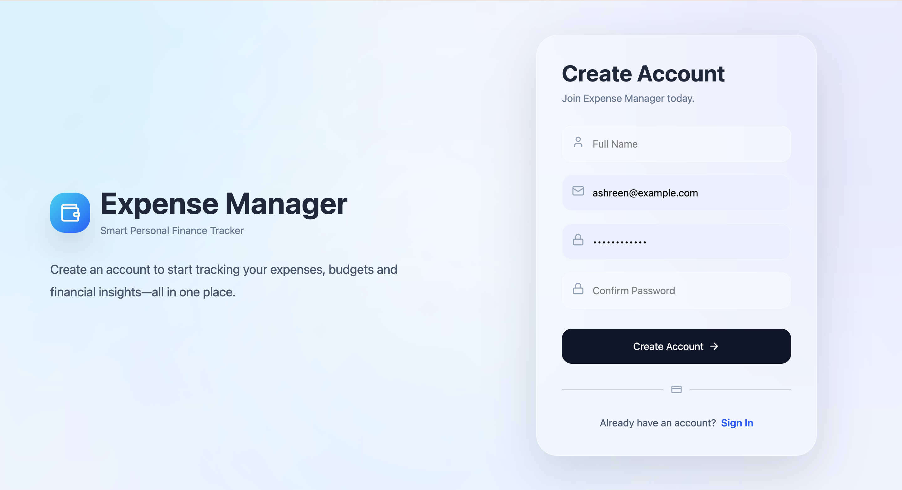
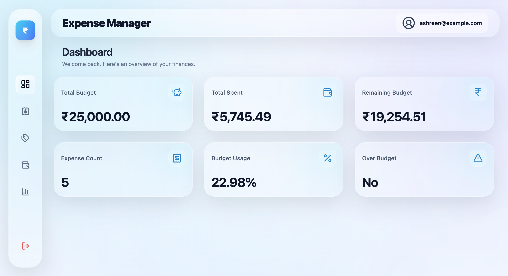
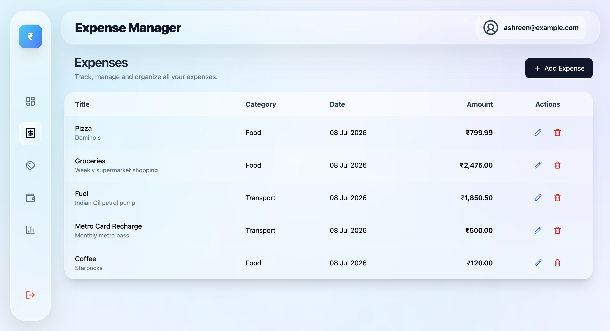
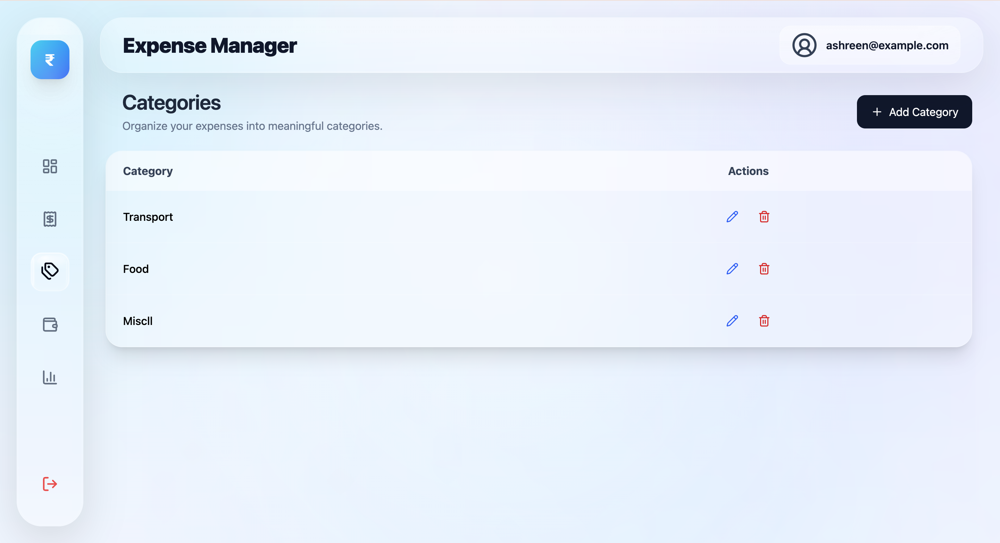
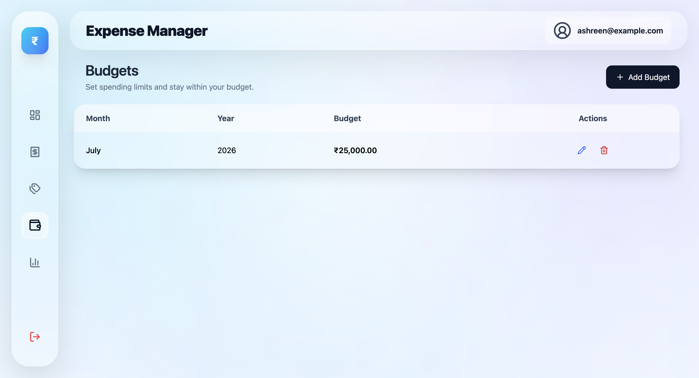

# 💰 Expense Manager

A modern **full-stack Expense Manager** built with **Spring Boot** and **React** to help users manage expenses, budgets, categories, and financial analytics through a clean and intuitive interface.

---

## ✨ Features

### 🔐 Authentication

- User Registration
- User Login
- JWT Authentication
- Protected Routes
- Secure Logout

### 📊 Dashboard

- Total Budget
- Total Spent
- Remaining Budget
- Expense Count

### 💸 Expense Management

- View Expenses
- Add Expenses
- Edit Expenses
- Delete Expenses

### 🗂️ Category Management

- View Categories
- Create Categories
- Edit Categories
- Delete Categories

### 💵 Budget Management

- View Budgets
- Create Monthly Budgets
- Update Budgets
- Delete Budgets

### 📈 Analytics

- Dashboard Summary
- Monthly Spending Trends
- Category-wise Spending Distribution
- Biggest Expense
- Recent Expenses

---

# 🛠️ Tech Stack

## Backend

- Java 21
- Spring Boot 3
- Spring Security
- JWT Authentication
- Spring Data JPA (Hibernate)
- PostgreSQL
- Flyway
- Maven
- Swagger / OpenAPI

## Frontend

- React (Vite)
- React Router
- Axios
- Tailwind CSS
- Framer Motion
- Recharts
- Lucide React

---

# 🏗️ Architecture

```
React (Vite)
      │
      ▼
 Axios + JWT
      │
      ▼
Spring Boot REST API
      │
      ▼
Spring Security
      │
      ▼
 PostgreSQL
```

---

# 📂 Project Structure

```
expense-manager/

├── backend/
│   ├── src/
│   ├── pom.xml
│   └── ...
│
├── frontend/
│   ├── src/
│   ├── public/
│   ├── package.json
│   └── ...
│
├── docker-compose.yml
└── README.md
```

---

# 📡 REST API

## Authentication

| Method | Endpoint |
|---------|----------|
| POST | `/api/v1/auth/register` |
| POST | `/api/v1/auth/login` |

---

## User

| Method | Endpoint |
|---------|----------|
| GET | `/api/v1/me` |

---

## Expenses

| Method | Endpoint |
|---------|----------|
| GET | `/api/v1/expenses` |
| POST | `/api/v1/expenses` |
| PUT | `/api/v1/expenses/{id}` |
| DELETE | `/api/v1/expenses/{id}` |

---

## Categories

| Method | Endpoint |
|---------|----------|
| GET | `/api/v1/categories` |
| POST | `/api/v1/categories` |
| PUT | `/api/v1/categories/{id}` |
| DELETE | `/api/v1/categories/{id}` |

---

## Budgets

| Method | Endpoint |
|---------|----------|
| GET | `/api/v1/budgets` |
| POST | `/api/v1/budgets` |
| PUT | `/api/v1/budgets/{id}` |
| DELETE | `/api/v1/budgets/{id}` |

---

## Analytics

| Method | Endpoint |
|---------|----------|
| GET | `/api/v1/analytics/dashboard` |
| GET | `/api/v1/analytics/monthly-spending` |
| GET | `/api/v1/analytics/category-spending` |
| GET | `/api/v1/analytics/recent-expenses` |
| GET | `/api/v1/analytics/biggest-expense` |

---

# 🗄️ Database

- PostgreSQL
- Flyway Database Migrations
- Docker Compose Support

---

# 🔑 Authentication

The API uses **JWT Authentication**.

After a successful login, include the token in every protected request:

```http
Authorization: Bearer <jwt-token>
```

---

# 🚀 Getting Started

## Clone Repository

```bash
git clone https://github.com/Ashreen-mulla/expense-manager.git
cd expense-manager
```

---

## Start PostgreSQL

```bash
docker compose up -d
```

---

## Run Backend

```bash
cd backend
./mvnw spring-boot:run
```

Backend runs at:

```
http://localhost:8080
```

---

## Run Frontend

```bash
cd frontend
npm install
npm run dev
```

Frontend runs at:

```
http://localhost:5173
```

---

# 📖 API Documentation

Swagger UI:

```
http://localhost:8080/swagger-ui/index.html
```

---

# 📦 Build

### Backend

```bash
./mvnw clean package
```

### Frontend

```bash
npm run build
```

---

# 📸 Screenshots

> Add screenshots after deployment.

- Login
- Register
- Dashboard
- Expenses
- Categories
- Budgets
- Analytics

---

# 🔮 Future Improvements

- Profile Management
- Toast Notifications
- Export Expenses (CSV / PDF)
- Dark Mode
- Mobile App

---

## 📸 Screenshots

### Login



### Register



### Dashboard



### Expenses



### Categories



### Budgets



# 👨‍💻 Author

**Ashreen Mulla**

GitHub: https://github.com/Ashreen-mulla